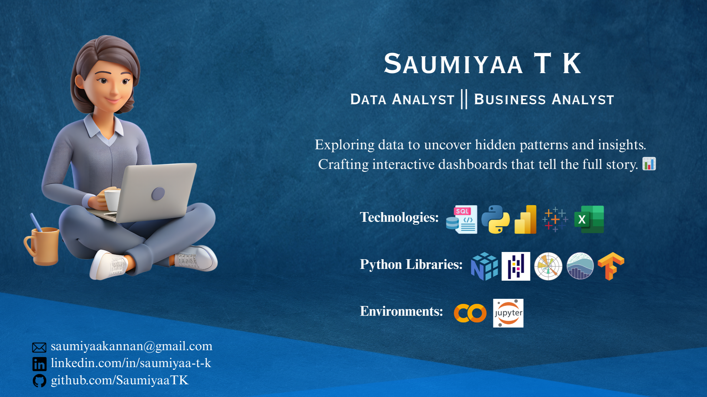
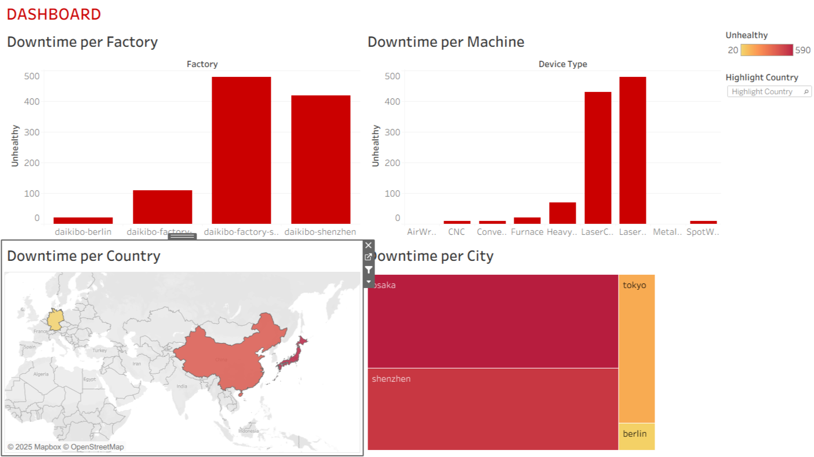

<!-- Profile views top-right -->

  

<!-- Header -->
<h1 align="center">Hello, I'm Saumiyaa</h1>

<!-- Purple-style animated intro -->

  

<!-- Subtitle -->
<h3 align="center">
  Data Analyst • Business Analyst • Data Storyteller from India
   
</h3>

<!-- Workspace image -->

    

---

## 🚀 About Me

I’m **Saumiyaa** ✨, a passionate **Data Analyst** 📊 who thrives on turning complex data into actionable insights.  
I enjoy creating interactive dashboards and reports that transform numbers into meaningful stories for decision-making.  
Skilled in **SQL, Python, Power BI, Tableau, and Excel**, I focus on uncovering patterns, trends, and KPIs that matter.  
Always eager to learn new tools and technologies, I aim to leverage data to solve real-world problems and create impactful solutions.  

---

## 🔭 Interests

- **Data Analysis & Insight Discovery** – Exploring datasets to uncover patterns and trends  
- **Dashboard Design & Visualization** – Creating interactive dashboards that tell stories  
- **Collaboration & Knowledge Sharing** – Working with teams to solve problems  
- **Machine Learning & AI Exploration** – Learning algorithms to enhance solutions  
- **Business Intelligence & Strategy** – Using data to guide business growth  

---

## 🛠️ Skills

- **Languages:** Python, SQL, DAX  
- **Libraries:** NumPy, Pandas, Matplotlib, Seaborn, TensorFlow, Scikit-learn  
- **Tools & Platforms:** Power BI, Tableau, Excel, GitHub, Jupyter, Google Colab  
- **Data Processing:** ETL, Data Modeling, Data Cleaning, Workflow Automation, Visualization  
- **Databases:** MySQL, MongoDB, PostgreSQL, SQL Server

---

## ✨ A Glimpse of My Dashboards 

<table align="center">
  <tr>
    <td align="center">
       
      <b>Global University Ranking Dashboard</b>
    </td>
    <td align="center">
       
      <b>Pandemic Analysis Dashboard</b>
    </td>
  </tr>
  <tr>
    <td align="center">
       
      <b>Fitness Tracker Dashboard</b>
    </td>
    <td align="center">
       
      <b>Equality Dashboard</b>
    </td>
  </tr>
  <tr>
    <td align="center">
       
      <b>Factory Downtime Dashboard</b>
    </td>
    <td align="center">
       
      <b>Amazon Sales Analytics Dashboard</b>
    </td>
  </tr>
</table>

--- 

## 🌟 My Story

- I see every dataset as a **story waiting to be told**  
- Obsessed with **simplifying complexity** through automation  
- I enjoy creating resources that help **early-career data professionals**  
- Always learning, exploring, and building  

---

## 🏅 Certifications & Workshops

📜 I continue to learn and grow through **workshops, bootcamps, and certifications** in data analytics.  

 

Focus Areas: **Data Cleaning | Visualization | Storytelling with Data**  

---

##  My GitHub Stats

<table>
  <tr>
    <td>
      
    </td>
  </tr>
</table>

<table>
  <tr>
    <td>
      
    </td>
  </tr>
</table>

<table>
  <tr>
    <td>
      
    </td>
  </tr>
</table>

<table>
  <tr>
    <td>
      
    </td>
  </tr>
</table>

---

## 🤝 Let’s Collaborate

I’m open to **collaborating on data, automation, or visualization projects** 🤝

 
 
 

---

## 🚀 Thanks for Stopping By!

Thank you for visiting my profile 💖  
If you found something useful, consider giving a ⭐ to support my work!  

  
  
  

<em>© 2025 SaumiyaaTK</em>

